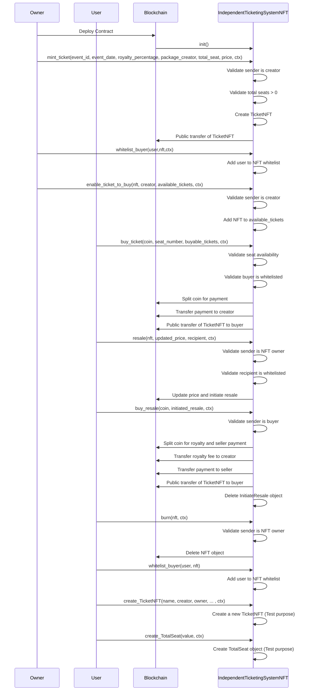

# Independent Ticketing System Package

In this tutorial, we will build an Independent Ticketing System utilizing the Move language for blockchain contracts and the [IOTA dApp kit](../../../ts-sdk/dapp-kit) for the frontend application. The project begins with [creating a Move package](../../getting-started/create-a-package.mdx), building and deploying it on the testnet network. Once the backend contract is operational, we will develop the [frontend dApp](./frontend.mdx). 

## Sequence Diagram 

This sequence diagram illustrates the flow of interactions within a decentralised ticketing system involving the Owner, User, Blockchain, and the `IndependentTicketingSystem` contract. The process begins with the Owner deploying the contract to the Blockchain, which initializes the contract. The Owner then mints a TicketNFT, specifying event details, while the contract verifies conditions like ownership and seat availability before transferring the NFT. Next, the Owner can whitelist a User to enable ticket purchases and then activate the ticket for sale. When a User buys a ticket, the contract validates seat availability and the whitelist status, processes payment, and transfers the NFT to the buyer. For resale, the User can list the NFT at a new price, and the contract handles royalty payments, ensures the buyer is whitelisted, and updates the Blockchain accordingly. The diagram also covers NFT burning, adding users to the whitelist, and creating new ticket objects for testing purposes. Each step ensures the system maintains security, ownership, and payment flow on the Blockchain.


## Prerequisites

- [Node.js](https://nodejs.org/en) >= v20.18.0
- [npx](https://www.npmjs.com/package/npx) >= 10.8.2
- [iota](https://github.com/iotaledger/iota/releases) >= 0.7.3

## Create a Move Package

Run the following command to [create a Move package](/developer/getting-started/create-a-package):

```bash
iota move new independent_ticketing_system && cd independent_ticketing_system
```

## Package Overview

### Struct and Constants

- [TicketNFT](https://github.com/iota-community/independent-ticketing-system/blob/c04202209bfba1eccedc9d192f5ec64916a5abf1/independent_ticketing_system/sources/independent_ticketing_system.move#L7-L18) - This struct contains the details of an NFT, including the event ID, event date, royalty percentage, creator, total seats, price, and owner.
- [CreatorCap](https://github.com/iota-community/independent-ticketing-system/blob/c04202209bfba1eccedc9d192f5ec64916a5abf1/independent_ticketing_system/sources/independent_ticketing_system.move#L20-L22) - This struct acts a creator cap for the package.
- [EventObject](https://github.com/iota-community/independent-ticketing-system/blob/c04202209bfba1eccedc9d192f5ec64916a5abf1/independent_ticketing_system/sources/independent_ticketing_system.move#L32-L36) - This struct contains the total number of seats for an event and an array of available tickets to buy.
- [InitiateResale](https://github.com/iota-community/independent-ticketing-system/blob/c04202209bfba1eccedc9d192f5ec64916a5abf1/independent_ticketing_system/sources/independent_ticketing_system.move#L24-L30) - This struct defines an shared object which will be created when a user wants to resale the NFT.

### [`init`](https://github.com/iota-community/independent-ticketing-system/blob/c04202209bfba1eccedc9d192f5ec64916a5abf1/independent_ticketing_system/sources/independent_ticketing_system.move#L60-L71)

In Move, the [`init`](../../iota-101/move-overview/init) function only runs once at package publication.
The `init` function will create three [`shared_object`](../../iota-101/objects/object-ownership/shared.mdx) type objects: 
- [`CreatorCap`](https://github.com/iota-community/independent-ticketing-system/blob/c04202209bfba1eccedc9d192f5ec64916a5abf1/independent_ticketing_system/sources/independent_ticketing_system.move#L20-L22) will use to verify the creator of the package.
- [`EventObject`](https://github.com/iota-community/independent-ticketing-system/blob/c04202209bfba1eccedc9d192f5ec64916a5abf1/independent_ticketing_system/sources/independent_ticketing_system.move#L32-L36) - it will contain the total number of seat for the event which will update as per minting the tickets and an array of all the NFT which are minted by the creator and are available to buy. To buy tickets, the first user needs to be whitelisted.

```move reference
https://github.com/iota-community/independent-ticketing-system/blob/6c6cd27bbf402dc3e1a219a2d6e5556eb968bb59/independent_ticketing_system/sources/independent_ticketing_system.move#L71-L85
```

### [`mint_ticket`](https://github.com/iota-community/independent-ticketing-system/blob/c04202209bfba1eccedc9d192f5ec64916a5abf1/independent_ticketing_system/sources/independent_ticketing_system.move#L73-L111)

- This function allows the creator to mint NFTs to their address.  
- The creator must provide the event object id so that things like the total number of seats can be checked. Also the creator has to own a creator capability to proof they are in fact the creator 
- Only the creator is authorized to mint these NFTs; no one else can perform this action.

```move reference
https://github.com/iota-community/independent-ticketing-system/blob/c04202209bfba1eccedc9d192f5ec64916a5abf1/independent_ticketing_system/sources/independent_ticketing_system.move#L73-L111
```

### [`enable_ticket_to_buy`](https://github.com/iota-community/independent-ticketing-system/blob/c04202209bfba1eccedc9d192f5ec64916a5abf1/independent_ticketing_system/sources/independent_ticketing_system.move#L113-L119)

- This function can only be called by the creator, as it enables the minted NFTs to be available for purchase.  
- It updates the [`EventObject`](https://github.com/iota-community/independent-ticketing-system/blob/c04202209bfba1eccedc9d192f5ec64916a5abf1/independent_ticketing_system/sources/independent_ticketing_system.move#L32-L36) shared object by adding the NFT to its `available_tickets_to_buy` field array.

```move reference
https://github.com/iota-community/independent-ticketing-system/blob/c04202209bfba1eccedc9d192f5ec64916a5abf1/independent_ticketing_system/sources/independent_ticketing_system.move#L113-L119
```

### [`transfer_ticket`](https://github.com/iota-community/independent-ticketing-system/blob/c04202209bfba1eccedc9d192f5ec64916a5abf1/independent_ticketing_system/sources/independent_ticketing_system.move#L121-L128)

- This function transfers the ownership of the `nft` to the `recipient` address.  
- The creator will not receive any royalty fee when this function is called.

```move reference
https://github.com/iota-community/independent-ticketing-system/blob/c04202209bfba1eccedc9d192f5ec64916a5abf1/independent_ticketing_system/sources/independent_ticketing_system.move#L121-L128
```

### [`resale`](https://github.com/iota-community/independent-ticketing-system/blob/c04202209bfba1eccedc9d192f5ec64916a5abf1/independent_ticketing_system/sources/independent_ticketing_system.move#L131-L151)

- This function makes the `nft` available for resale.  
- The `recipient` address must first be whitelisted for the `nft`. To whitelist the recipient, the user will call the [whitelist_buyer](#whitelist_buyer) function.
- The function creates a new object called [`InitiateResale`](https://github.com/iota-community/independent-ticketing-system/blob/c04202209bfba1eccedc9d192f5ec64916a5abf1/independent_ticketing_system/sources/independent_ticketing_system.move#L24-L30) and transfers its ownership to the `recipient` address.

```move reference
https://github.com/iota-community/independent-ticketing-system/blob/c04202209bfba1eccedc9d192f5ec64916a5abf1/independent_ticketing_system/sources/independent_ticketing_system.move#L131-L151
```

### [`buy_ticket`](https://github.com/iota-community/independent-ticketing-system/blob/c04202209bfba1eccedc9d192f5ec64916a5abf1/independent_ticketing_system/sources/independent_ticketing_system.move#L154-L190)

- This function allows the purchase of NFTs listed in the [`EventObject`](https://github.com/iota-community/independent-ticketing-system/blob/c04202209bfba1eccedc9d192f5ec64916a5abf1/independent_ticketing_system/sources/independent_ticketing_system.move#L32-L36) object.  
- The buyer must first be whitelisted.  
- The object ID of the [`EventObject`](https://github.com/iota-community/independent-ticketing-system/blob/c04202209bfba1eccedc9d192f5ec64916a5abf1/independent_ticketing_system/sources/independent_ticketing_system.move#L32-L36) object must be provided when calling the function.

```move reference
https://github.com/iota-community/independent-ticketing-system/blob/c04202209bfba1eccedc9d192f5ec64916a5abf1/independent_ticketing_system/sources/independent_ticketing_system.move#L154-L190
```

### [`buy_resale`](https://github.com/iota-community/independent-ticketing-system/blob/c04202209bfba1eccedc9d192f5ec64916a5abf1/independent_ticketing_system/sources/independent_ticketing_system.move#L193-L210)

- This function transfers the ownership of the NFT wrapped in the [`InitiateResale`](https://github.com/iota-community/independent-ticketing-system/blob/c04202209bfba1eccedc9d192f5ec64916a5abf1/independent_ticketing_system/sources/independent_ticketing_system.move#L24-L30) object.  
- The caller's address must match the buyer address of the [`InitiateResale`](https://github.com/iota-community/independent-ticketing-system/blob/c04202209bfba1eccedc9d192f5ec64916a5abf1/independent_ticketing_system/sources/independent_ticketing_system.move#L24-L30) object.  
- A royalty fee will be transferred to the creator of the NFT by the caller of this function.

```move reference
https://github.com/iota-community/independent-ticketing-system/blob/c04202209bfba1eccedc9d192f5ec64916a5abf1/independent_ticketing_system/sources/independent_ticketing_system.move#L193-L210
```

### [`burn`](https://github.com/iota-community/independent-ticketing-system/blob/c04202209bfba1eccedc9d192f5ec64916a5abf1/independent_ticketing_system/sources/independent_ticketing_system.move#L213-L226)

- This function burns the NFT, removing the NFT object from the owner's account.  
- Only the NFT's owner is authorized to burn the NFT.

```move reference
https://github.com/iota-community/independent-ticketing-system/blob/c04202209bfba1eccedc9d192f5ec64916a5abf1/independent_ticketing_system/sources/independent_ticketing_system.move#L213-L226
```

### [`whitelist_buyer`](https://github.com/iota-community/independent-ticketing-system/blob/c04202209bfba1eccedc9d192f5ec64916a5abf1/independent_ticketing_system/sources/independent_ticketing_system.move#L234-L236)

- This function allows the owner of an NFT to whitelist a user.  
- Once whitelisted, the user becomes eligible to purchase the NFT.

```move reference
https://github.com/iota-community/independent-ticketing-system/blob/c04202209bfba1eccedc9d192f5ec64916a5abf1/independent_ticketing_system/sources/independent_ticketing_system.move#L234-L236
```

See the full example of the contract on [github](https://github.com/iota-community/independent-ticketing-system/blob/main/independent_ticketing_system/sources/independent_ticketing_system.move) .

### Write Unit Tests

After creating the module write the test for all the functions. Move the below code to the `independent_ticketing_system_test.move` file:

```move reference 
https://github.com/iota-community/independent-ticketing-system/blob/794492c7710358da53a9c01a85011f42eaea5500/independent_ticketing_system/tests/independent_ticketing_system_test.move
```

### Publish the Package

[Publish](../../getting-started/publish.mdx) the package to the IOTA Testnet using the following command:

```bash 
iota client publish
```