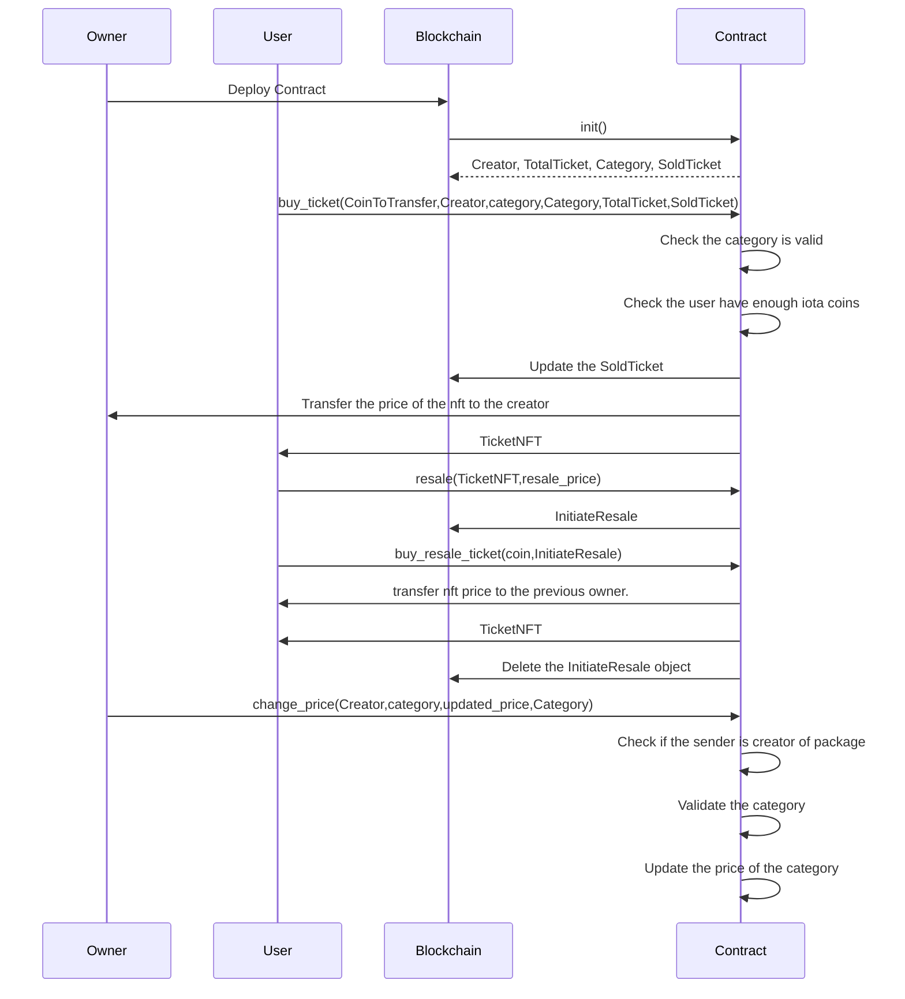

# Live Concerts Ticketing System

In this tutorial, we will create an on-chain live concert ticketing system on which users can buy tickets for the concert. There will be multiple categories of tickets, and every single ticket will be an NFT and can have different prices after being in the same category. The admin can update the price of tickets in categories. A user can also resell the ticket by specifying the cost of the ticket. The tutorial will cover the move package and the frontend dApp part. We will walk you through the step-by-step process of creating a Move package and the frontend dApp using the IOTA dApp kit. By the end, you'll have a fully functional dApp that allows users to buy/resale tickets effortlessly.

## Live Concerts Ticketing System Architecture Overview



## Prerequisites

- [Node.js](https://nodejs.org/) >=v20.18.0
- [npx](https://www.npmjs.com/package/npx) >=10.8.2
- [iota](https://github.com/iotaledger/iota/releases) >=0.7.3 

## Create a Move Package

Run the following command to [create a Move package](/developer/getting-started/create-a-package), and move into its directory:

```bash
iota move new live_concert && cd live_concert
```

## Package Overview

### Struct and Constants

The following structs and constants are used in the package:

- [TicketNFT](https://github.com/iota-community/on-chain-live-concerts-ticketing-system/blob/3e902862a27886231a1721ab3609100326d284ad/package/sources/live_concert.move#L10-L16) - This struct will store the ticket information.
- [Creator](https://github.com/iota-community/on-chain-live-concerts-ticketing-system/blob/3e902862a27886231a1721ab3609100326d284ad/package/sources/live_concert.move#L18-L21) - This struct will store the creator of the package.
- [TotalTicket](https://github.com/iota-community/on-chain-live-concerts-ticketing-system/blob/3e902862a27886231a1721ab3609100326d284ad/package/sources/live_concert.move#L23-L29) - This struct will store the total number of seats of concerts.
- [SoldTicket](https://github.com/iota-community/on-chain-live-concerts-ticketing-system/blob/3e902862a27886231a1721ab3609100326d284ad/package/sources/live_concert.move#L30-L36) - This struct will store the total number of seats sold to date.
- [InitiateResale](https://github.com/iota-community/on-chain-live-concerts-ticketing-system/blob/3e902862a27886231a1721ab3609100326d284ad/package/sources/live_concert.move#L38-L43) - This struct will be generated when a user wants to resell the ticket.
- [Category](https://github.com/iota-community/on-chain-live-concerts-ticketing-system/blob/3e902862a27886231a1721ab3609100326d284ad/package/sources/live_concert.move#L45-L48) - This struct will store all types of seats (silver,gold and platinium).
- [`SILVER_TICKET_PRICE`](https://github.com/iota-community/on-chain-live-concerts-ticketing-system/blob/3e902862a27886231a1721ab3609100326d284ad/package/sources/live_concert.move#50) - This constant will store the price of a silver ticket.
- [`GOLD_TICKET_PRICE`](https://github.com/iota-community/on-chain-live-concerts-ticketing-system/blob/3e902862a27886231a1721ab3609100326d284ad/package/sources/live_concert.move#51) - This constant will store the price of a gold ticket.
- [`PLATINIUM_TICKET_PRICE`](https://github.com/iota-community/on-chain-live-concerts-ticketing-system/blob/3e902862a27886231a1721ab3609100326d284ad/package/sources/live_concert.move#52) - This constant will store the price of a platinium ticket.
- [`RESALE_LIMIT`](https://github.com/iota-community/on-chain-live-concerts-ticketing-system/blob/3e902862a27886231a1721ab3609100326d284ad/package/sources/live_concert.move#53) - This constant will store the limit on reselling of a ticket NFT.

```move reference
https://github.com/iota-community/on-chain-live-concerts-ticketing-system/blob/3e902862a27886231a1721ab3609100326d284ad/package/sources/live_concert.move#L10-L64
```

### [`init`](https://github.com/iota-community/on-chain-live-concerts-ticketing-system/blob/3e902862a27886231a1721ab3609100326d284ad/package/sources/live_concert.move#L66-L96)

In Move, the [`init`](../iota-101/move-overview/init) function only runs once at package publication.
The `init` function will create four [`shared_object`](../iota-101/objects/object-ownership/shared.mdx) type objects: 
- [`Creator`](https://github.com/iota-community/on-chain-live-concerts-ticketing-system/blob/3e902862a27886231a1721ab3609100326d284ad/package/sources/live_concert.move#L18-L21) will be used to verify the creator of the package.
- [`TotalTicket`](https://github.com/iota-community/on-chain-live-concerts-ticketing-system/blob/3e902862a27886231a1721ab3609100326d284ad/package/sources/live_concert.move#L23-L29) will store the total number of seats of concerts.
- [`SoldTicket`](https://github.com/iota-community/on-chain-live-concerts-ticketing-system/blob/3e902862a27886231a1721ab3609100326d284ad/package/sources/live_concert.move#L30-L36) will store the total number of seats sold to date.
- [`Category`](https://github.com/iota-community/on-chain-live-concerts-ticketing-system/blob/3e902862a27886231a1721ab3609100326d284ad/package/sources/live_concert.move#L45-L48) will store all types of seats (silver,gold and platinium).

```move reference
https://github.com/iota-community/on-chain-live-concerts-ticketing-system/blob/3e902862a27886231a1721ab3609100326d284ad/package/sources/live_concert.move#L66-L96
```

### [`buy_ticket`](https://github.com/iota-community/on-chain-live-concerts-ticketing-system/blob/3e902862a27886231a1721ab3609100326d284ad/package/sources/live_concert.move#L99-L133)

- This function allows anyone to purchase tickets.
- This function will set a limit on reselling the ticket NFT.

```move reference
https://github.com/iota-community/on-chain-live-concerts-ticketing-system/blob/3e902862a27886231a1721ab3609100326d284ad/package/sources/live_concert.move#L99-L133
```

### [`resale`](https://github.com/iota-community/on-chain-live-concerts-ticketing-system/blob/3e902862a27886231a1721ab3609100326d284ad/package/sources/live_concert.move#L150-L164)

- This function allows users to resell their tickets.
- Users can also set the price at which they want to resell the ticket.
- The `resale` function then creates a [`shared_object`](../iota-101/objects/object-ownership/shared.mdx) type objects `InitiateResale` in which the NFT and its resell price will be stored.

```move reference
https://github.com/iota-community/on-chain-live-concerts-ticketing-system/blob/3e902862a27886231a1721ab3609100326d284ad/package/sources/live_concert.move#L150-L164
```

### [`buy_resale_ticket`](https://github.com/iota-community/on-chain-live-concerts-ticketing-system/blob/3e902862a27886231a1721ab3609100326d284ad/package/sources/live_concert.move#L167-L187)

- This function allows users to buy the tickets that are on resale.
- Users will pass the address of the `InitiateResale` object that will store the NFT users want to buy.
- The function then unwraps the NFT from the shared object and transfers it to the sender.
- The `InitiateResale` object will be deleted, and the price of reselling the NFT will be transferred to its previous owner.

```move reference
https://github.com/iota-community/on-chain-live-concerts-ticketing-system/blob/3e902862a27886231a1721ab3609100326d284ad/package/sources/live_concert.move#L167-L187
```

### [`change_price`](https://github.com/iota-community/on-chain-live-concerts-ticketing-system/blob/3e902862a27886231a1721ab3609100326d284ad/package/sources/live_concert.move#L135-L148)

- Only the creator of the package can call this function.
- This function allows the creator to change the price of a category, by updating the `Category` object.

```move reference
https://github.com/iota-community/on-chain-live-concerts-ticketing-system/blob/3e902862a27886231a1721ab3609100326d284ad/package/sources/live_concert.move#L135-L148
```

:::note Helper Functions
	There are some helper functions in the package that are used by the above functions.
:::

### Write Unit Tests

After creating the module, you should write the tests for all the functions. Copy the below code to the `live_concert_tests.move` file:

```move reference
https://github.com/iota-community/on-chain-live-concerts-ticketing-system/blob/3e902862a27886231a1721ab3609100326d284ad/package/tests/live_concert_tests.move
```

### Publish the Package

[Publish](../getting-started/publish.mdx) the package to the IOTA Testnet using the following command:

```bash 
iota client publish
```

## Frontend dApp

Next, let's create the user interface for the live concert ticketing system. To build the frontend dApp, we will use the [IOTA dApp kit](../../../ts-sdk/dapp-kit/).

### Set Up

Run the following command to set up the initial app:

```bash
npm create @iota/dapp
```

### Set Up Network Configuration

Add the following variables in the [`networkConfig.ts`](https://github.com/iota-community/on-chain-live-concerts-ticketing-system/blob/main/frontend/src/networkConfig.ts) file:

```typescript reference
https://github.com/iota-community/on-chain-live-concerts-ticketing-system/blob/3e902862a27886231a1721ab3609100326d284ad/frontend/src/networkConfig.ts
```

To get the address for the above variables, see the transaction digest of your package publication or see the public transaction on the [IOTA Testnet Explorer](https://explorer.rebased.iota.org/?network=testnet).

### Folder Structure

- [src](https://github.com/iota-community/on-chain-live-concerts-ticketing-system/tree/main/frontend/src)
   * [components](https://github.com/iota-community/on-chain-live-concerts-ticketing-system/tree/main/frontend/src/components)
      * [Button.tsx](https://github.com/iota-community/on-chain-live-concerts-ticketing-system/blob/main/frontend/src/components/Button.tsx)
      * [Form.tsx](https://github.com/iota-community/on-chain-live-concerts-ticketing-system/blob/main/frontend/src/components/Form.tsx)
      * [Home.tsx](https://github.com/iota-community/on-chain-live-concerts-ticketing-system/blob/main/frontend/src/components/Home.tsx)
      * [Loading.tsx](https://github.com/iota-community/on-chain-live-concerts-ticketing-system/blob/main/frontend/src/components/Loading.tsx)
      * [LoadingBar.tsx](https://github.com/iota-community/on-chain-live-concerts-ticketing-system/blob/main/frontend/src/components/LoadingBar.tsx)
   * [hooks](https://github.com/iota-community/on-chain-live-concerts-ticketing-system/blob/main/frontend/src/hooks)
      * [userForm.ts](https://github.com/iota-community/on-chain-live-concerts-ticketing-system/blob/main/frontend/src/hooks/userForm.ts)
   * [utils](https://github.com/iota-community/on-chain-live-concerts-ticketing-system/blob/main/frontend/src/utils)
      * [buyResaleTicket.ts](https://github.com/iota-community/on-chain-live-concerts-ticketing-system/blob/main/frontend/src/utils/buyResaleTicket.ts)
      * [buyTicket.ts](https://github.com/iota-community/on-chain-live-concerts-ticketing-system/blob/main/frontend/src/utils/buyTicket.ts)
      * [changePrice.ts](https://github.com/iota-community/on-chain-live-concerts-ticketing-system/blob/main/frontend/src/utils/changePrice.ts)
      * [parseAddress.ts](https://github.com/iota-community/on-chain-live-concerts-ticketing-system/blob/main/frontend/src/utils/parseAddress.ts)
      * [resale.ts](https://github.com/iota-community/on-chain-live-concerts-ticketing-system/blob/main/frontend/src/utils/resale.ts)
      * [submitForm.ts](https://github.com/iota-community/on-chain-live-concerts-ticketing-system/blob/main/frontend/src/utils/submitForm.ts)
   * [App.tsx](https://github.com/iota-community/on-chain-live-concerts-ticketing-system/blob/main/frontend/src/App.tsx)
   * [main.tsx](https://github.com/iota-community/on-chain-live-concerts-ticketing-system/blob/main/frontend/src/main.tsx)

### [Form.tsx](https://github.com/iota-community/on-chain-live-concerts-ticketing-system/blob/main/frontend/src/components/Form.tsx)

The `Form.tsx` component is an input form used to collect inputs for all operations. It is a versatile component utilized everywhere.

```typescript reference
https://github.com/iota-community/on-chain-live-concerts-ticketing-system/blob/3e902862a27886231a1721ab3609100326d284ad/frontend/src/components/Form.tsx
```

### [Home.tsx](https://github.com/iota-community/on-chain-live-concerts-ticketing-system/blob/main/frontend/src/components/Home.tsx)

The `Home.tsx` component displays buttons for all operations and a list of owned objects associated with the currently connected account.

```typescript reference
https://github.com/iota-community/on-chain-live-concerts-ticketing-system/blob/3e902862a27886231a1721ab3609100326d284ad/frontend/src/components/Home.tsx
```

### [submitForm.ts](https://github.com/iota-community/on-chain-live-concerts-ticketing-system/blob/main/frontend/src/utils/submitForm.ts)

This file contains a function that calls functions for specific operations like buy or resale.

```typescript reference
https://github.com/iota-community/on-chain-live-concerts-ticketing-system/blob/3e902862a27886231a1721ab3609100326d284ad/frontend/src/utils/submitForm.ts
```

### [App.tsx](https://github.com/iota-community/on-chain-live-concerts-ticketing-system/blob/main/frontend/src/App.tsx)

This component serves as the entry point, containing the navbar and the home component.

```typescript reference
https://github.com/iota-community/on-chain-live-concerts-ticketing-system/blob/3e902862a27886231a1721ab3609100326d284ad/frontend/src/App.tsx
```


## Usage Example

### Dashboard


