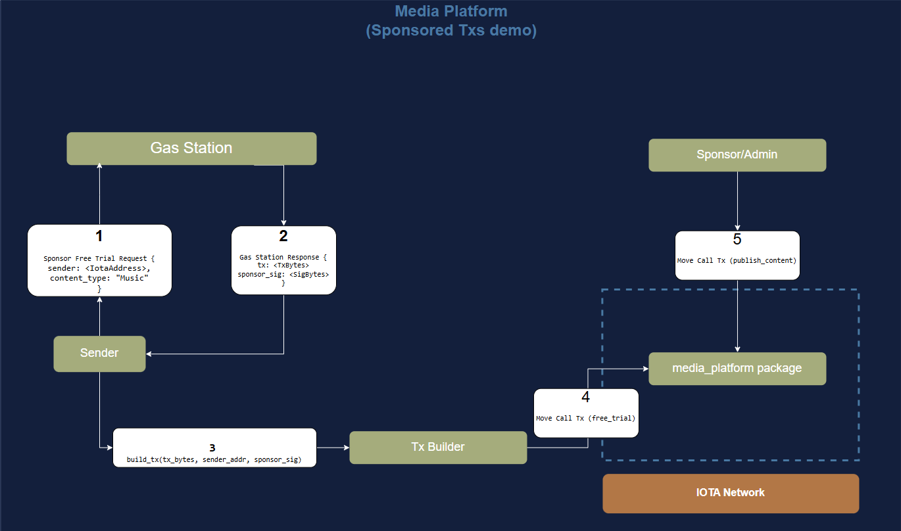

# Sponsored Transactions: Part I

In this tutorial, we will learn how to create a [sponsored transaction](../../iota-101/transactions/sponsored-transactions/about-sponsored-transactions.mdx) on the IOTA network using the [IOTA Rust SDK](../../../references/rust-sdk.mdx).
We are going to create a media platform, where users can subscribe to several types of content. There is a free trial option, from which users can try the service for a limited time.
For new users on the IOTA network, the platform admin will sponsor the gas fees for the `free trial` option. This will allow users to experience the platform without having to pay for gas fees nor subscription fees.

## Architecture and Flow Overview

The workflow of the sponsored transaction is as follows:
    - A user who does not have an IOTA balance wants to subscribe to the free trial option. They will send a request to the Gas Station server to sponsor their transaction alongside content type (Music, News or Movies).
    - The [Gas Station server] will verify that this user has not used the free trial option before. If the user is eligible, the Gas Station will build a transaction (with gas payment from the sponsor's balance), sign it, and send back both the transaction and the signature separately as the response.
    - The user, having received the transaction and the sponsor's signature, will sign the transaction and send it to the IOTA network. The user can do this using the CLI, Rust SDK or TS SDK. In this part, we will use the Rust SDK.
    - The sponsor/admin (they can be different addresses, but for simplicity, we will assume they are the same) can now call the `publish` content function on the platform to publish the content to the user's address.

## Getting Started

To build the architecture, we are going to create three components:
1.  [The Media Platform's Move package for the sponsored transactions](./media-platform-package.mdx).
2.   [The Gas Station server](./gas-station-server.mdx).
3.   [The Transaction Builder](./transaction-builder.mdx).

To complete this tutorial, you will need to follow the steps in each part in order. Good luck!