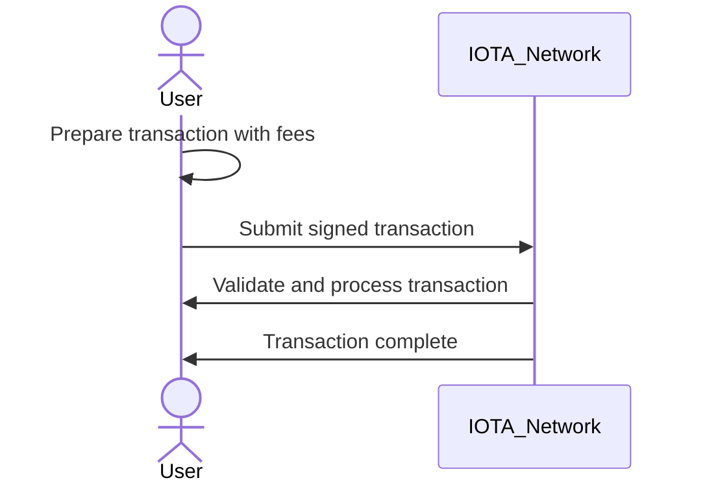
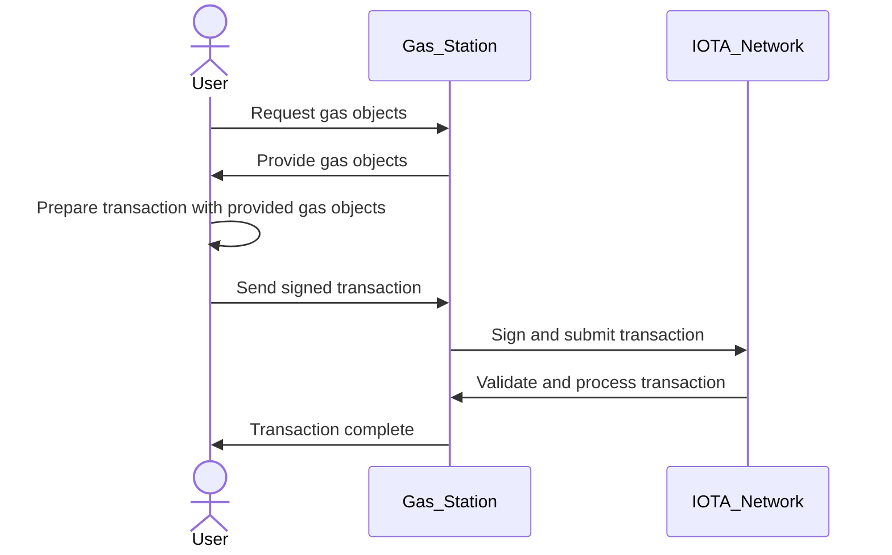

The transition from Web2 to Web3 presents a significant challenge—how can applications provide seamless and user-friendly interactions while maintaining the security and decentralized principles of blockchain technology? This is where the **IOTA Gas Station** comes into play.

The IOTA Gas Station is a mechanism that enables **sponsored transactions**, allowing users to interact with the IOTA network without directly managing transaction fees. This is particularly valuable for developers building decentralized applications (dApps) where the user experience must remain simple and intuitive.

## The Problem: Transaction Fees in Web3

Unlike traditional Web2 applications, where users do not need to worry about transaction costs, Web3 applications require users to pay network fees to validate and store transactions. However, expecting users to manage and maintain IOTA tokens solely for transaction fees introduces friction and discourages adoption.

The **IOTA Gas Station** addresses this challenge by acting as an intermediary between the user and the network. It allows developers to cover transaction costs on behalf of users, making interactions frictionless while preserving the fundamental aspects of security and authentication in Web3.

---

## User Flow

### Standard User Flow (Without Gas Station)

In a typical Web3 interaction, a user wishing to execute a transaction must first acquire IOTA tokens. This means they need to set up a wallet, fund it with IOTA tokens, and ensure they have enough balance to cover the transaction fees. When they prepare a transaction, the necessary fee is deducted from their wallet, and the transaction is submitted to the network for validation and processing. Once confirmed, the transaction is complete, and the updated balance reflects the fee deduction.

While this process ensures security and decentralization, it also places a burden on users who may not be familiar with acquiring and managing tokens. The need to maintain a balance introduces friction, potentially discouraging mainstream adoption.

### Enhanced User Flow with Gas Station

With the introduction of the **IOTA Gas Station**, the transaction process becomes significantly more user-friendly. Instead of requiring users to hold IOTA tokens, the Gas Station acts as an intermediary that sponsors the transaction fees. The user still prepares their transaction as before, but instead of supplying their own gas fees, they request a **gas object** from the Gas Station. Once received, they sign the transaction, incorporating the provided gas object. The signed transaction is then sent back to the Gas Station, which finalizes it by adding its own signature and submitting it to the network.

By abstracting the complexity of fee management, the Gas Station enables a **fee-less experience** for users while preserving the security and authentication guarantees of Web3. This model allows developers to integrate blockchain transactions into their applications without requiring users to engage with the underlying tokenomics.

---
