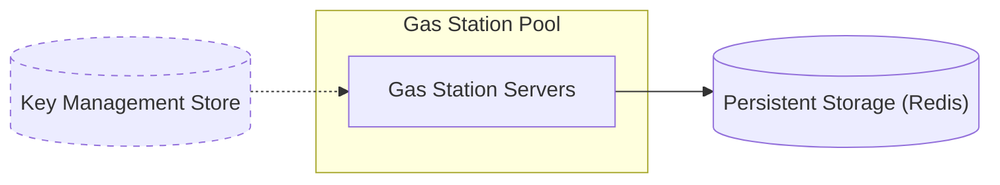
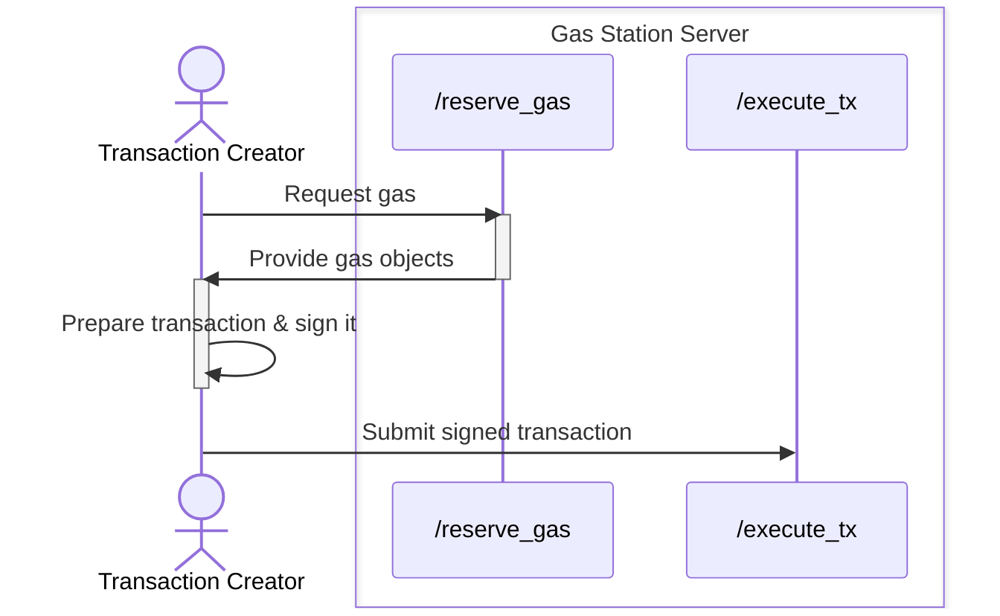
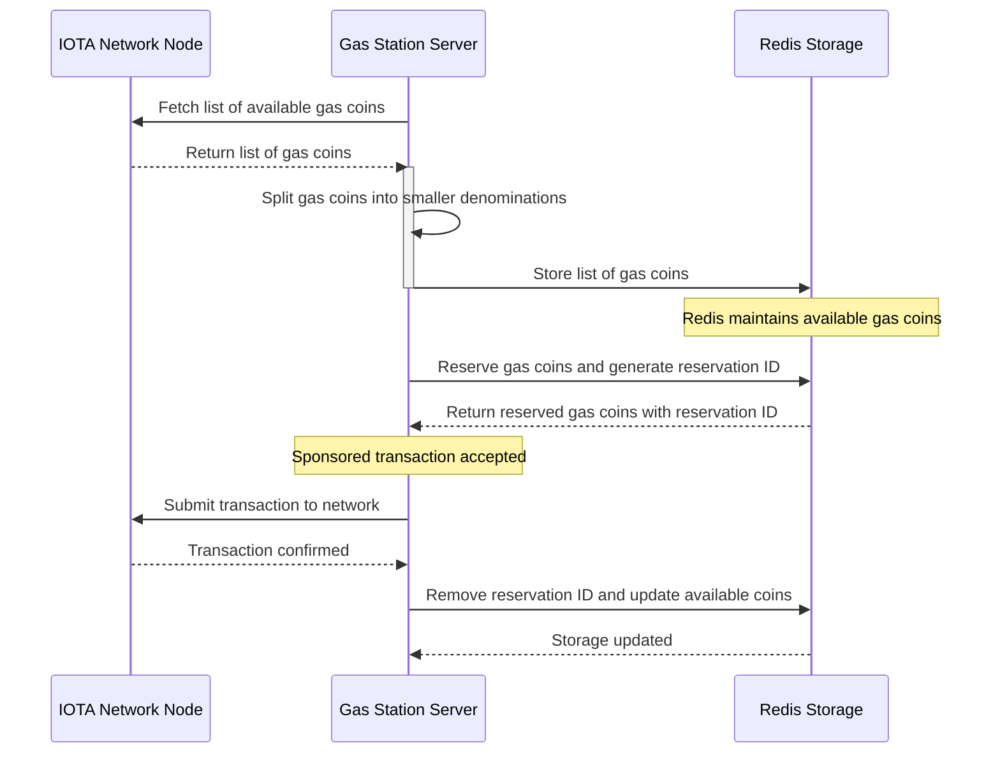
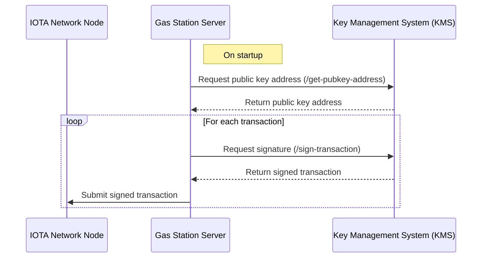

The **IOTA Gas Station** consists of several key components, each playing a crucial role in managing transactions efficiently and securely.

##  Gas Station Server

The **Gas Station Server** is the central component of the system. Each deployment of a Gas Station Server is associated with a single sponsor wallet, responsible for funding transactions. To scale operations, multiple Gas Station Servers can be deployed together as a **Gas Station Pool**, allowing them to share the same sponsor address and persistent storage.

### HTTP Endpoints:

The server provides two main endpoints to facilitate transaction management:

* [`/reserve_gas`](../api-reference/api-reference.mdx#reserve-gas) – Reserves gas objects that meet the specified amount required for a transaction.
* [`/execute_tx`](../api-reference/api-reference.mdx#execute-transaction)** – Executes a transaction using the gas objects previously fetched from `/reserve_gas`.

### Transaction Lifecycle

The lifecycle of a transaction within the Gas Station follows a structured flow. The process begins when the **user**, who does not hold IOTA tokens for fees, initiates an interaction with the Gas Station by making a request to the `/reserve_gas` endpoint. This request specifies the amount of gas required for the upcoming transaction. The Gas Station processes this request and allocates the necessary gas objects from its internal pool, returning them to the user.

With the gas objects in hand, the user then prepares their transaction, embedding the allocated gas within it. Once the transaction is properly constructed, the user signs it, ensuring its authenticity and integrity. The signed transaction is then submitted to the Gas Station through the `/execute_tx` endpoint.

At this stage, the Gas Station takes responsibility for finalizing the transaction. It verifies the validity of the submitted transaction, attaches its own signature, and submits the transaction to the IOTA network for processing. The network validates and executes the transaction, recording it permanently on the blockchain. Once the transaction is confirmed, the Gas Station relays the execution results back to the user, signaling the successful completion of the process.

## Gas Station Storage

The **Gas Station Storage** serves as the persistent database for managing gas objects and transaction states. The storage layer, powered by Redis, keeps track of all available gas coins, ensuring that transactions can be sponsored efficiently. Redis together with LUA scripts provide a built-in mechanism that supports concurrent access from multiple Gas Station Servers, allowing for scalable and high-performance operations. This ensures that multiple servers in a Gas Station Pool can efficiently share and allocate gas resources without conflicts. It is essential for ensuring continuity, especially when gas pools are depleted and must be replenished.

To maintain consistency with the network, the storage state is periodically synchronized with the configured interval. This interval is defined in `config.yaml` under `refresh-interval-sec`, ensuring that the system regularly verifies and updates its stored state based on the actual conditions of the IOTA network.

**Gas Station Storage usage process:**

The Gas Station continuously synchronizes its storage with the network to ensure accurate gas coin tracking. It periodically fetches available gas coins from the IOTA Network Node, splits them into smaller denominations, and updates Redis with these entries. When a user requests gas, the Gas Station retrieves the required coins from Redis, assigns a reservation ID, and marks them as in use. Once the transaction is executed, the reservation ID is removed, and the list of available gas coins is updated accordingly. This process ensures that only valid gas coins are used while preventing inconsistencies between the Gas Station and the network.

:::note **Important Considerations:**

* A single Redis instance **should not** be used for Gas Station Servers that operate with different sponsor wallets. Doing so could lead to conflicts and incorrect transaction processing.
* When switching between networks (e.g., from a testnet to a mainnet), all Redis entries should be cleared to prevent the Gas Station from returning outdated or non-existent objects. This can be done manually by flushing the Redis database before reinitializing the Gas Station instance. The storage layer, powered by Redis, keeps track of all available gas coins, ensuring that transactions can be sponsored efficiently.

:::

## Key Store Manager

The **Key Store Manager (KSM)** provides secure key management for signing transactions. It offers two configurations:

* **External Key Management Services (KMS)** – Uses external providers like AWS KMS for enhanced security.
* **In-memory key storage** – Maintains private keys within the Gas Station instance for faster but less secure operations.

**External Key Store** is an optional component that facilitates secure transaction signing by integrating an **external Key Management System (KMS)**. This feature simplifies key management, particularly when deploying multiple Gas Station Servers as a pool that shares the same signing key across multiple instances.

### External KMS Integration

The Gas Station assumes that the external KMS will communicate using a **JSON API**. The KMS must expose the following two endpoints:

* **GET `/get-pubkey-address`**
  This endpoint returns the public key address corresponding to the stored private key encoded in base64
* **POST `/sign-transaction`**
  This endpoint is responsible for signing transactions. The request payload is a JSON object containing the base64-encoded and BCS-serialized transaction data

It is crucial that the serialized signature and keys  adhere to the **IOTA transaction signature specification**. Developers should refer to the [IOTA documentation](https://docs.iota.org/developer/cryptography/transaction-auth/signatures#signature-requirements) for further details on signature requirements.

For a reference implementation of a compatible KMS, developers can explore the sample implementation provided in the official repository: [IOTA Gas Station Sample KMS Sidecar](https://github.com/iotaledger/gas-station/tree/dev/sample_kms_sidecar).

