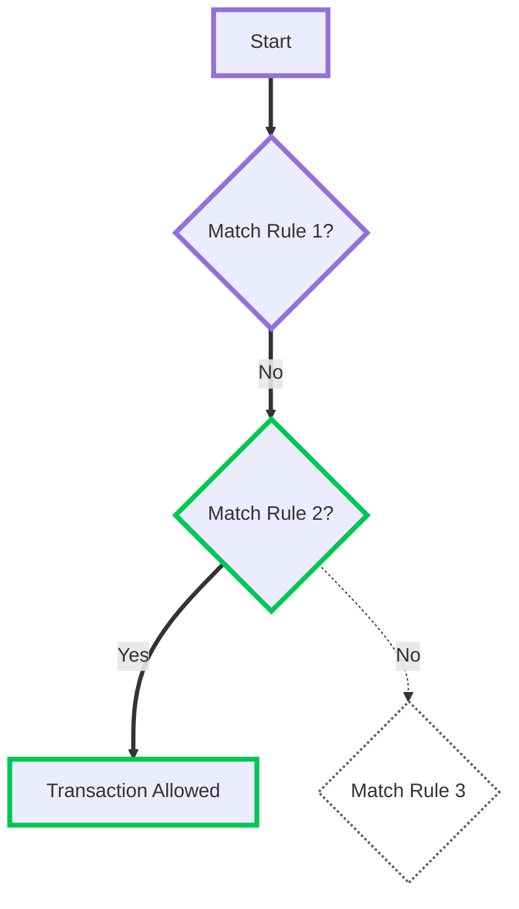
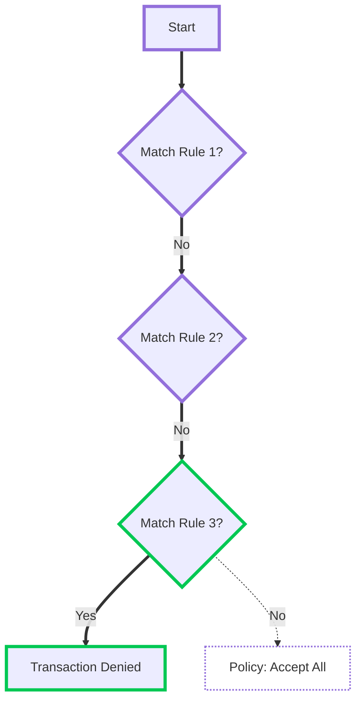
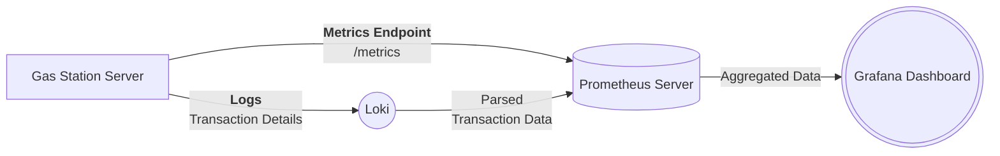

## Access Controller

The **Access Controller** is a rule-based system that regulates access to the `/execute_tx` endpoint. Similar to firewalls, it enforces policies to determine which transactions are allowed or denied.

### Access Policy Modes

The Access Controller operates in one of two modes:

* **Deny All:** A strict security model where all transactions are blocked by default. Rules must be explicitly defined to allow specific transactions.
* **Allow All:** A more permissive model where all transactions are allowed by default. Rules are used to selectively deny certain transactions.

:::warning Important Note
While the **`/reserve_gas`** endpoint remains unprotected by the ACL, potential abuse (such as multiple reservation attacks) is mitigated through configuration options like maximum reservation limits and expiration times.
:::

### Rule Processing

The Access Controller processes rules sequentially, much like rule-based filtering systems such as firewalls. Each rule is evaluated in order, and once a matching rule is found, its action is applied, preventing further rules from being checked. This ensures predictable behavior where the most specific rules are placed earlier, while broader rules serve as fallbacks.

When a transaction is submitted, the Access Controller starts by checking the first rule in the list. If the transaction matches the conditions set in that rule, the corresponding action is taken, either allowing or denying the transaction. If no match is found, the system proceeds to the next rule in sequence. This process continues until either a rule applies or no rules match, in which case the system falls back to the default policy (either **Allow All** or **Deny All**).

### Example

For example, consider the following **Allow All** policy configuration with three rules:

```yaml
# Rule 1
- sender-address: 0x0202020202020202020202020202020202020202020202020202020202020202
  transaction-gas-budget: <=500000
  action: allow

# Rule 2
- sender-address: 0x0101010101010101010101010101010101010101010101010101010101010101
  transaction-gas-budget: <=10000000
  action: allow

# Rule 3
- sender-address: *
  action: deny
```

Rule 1: Allow transactions from 0x0202... with a gas budget ≤ 500000\.

Rule 2: Allow transactions from 0x0101... with a gas budget ≤ 1000000\.

Rule 3: Deny all other transactions.

#### Evaluation Example 1

A sender `0x0101...` submits a transaction with a `900000` gas budget. The system evaluates `Rule 1` first but skips it since the sender’s address does not match. `Rule 2` is then checked, and since both the sender and gas budget conditions are satisfied, the transaction is allowed.



**Explanation:**

| rule   | explanation                                                                 |
|--------|-----------------------------------------------------------------------------|
| Rule 1 | Checked first but skipped as the sender doesn’t match.                      |
| Rule 2 | Evaluated, and since the sender and budget match, the transaction is **allowed**. |
| Rule 3 | Never reached because Rule 2 applied.                                       |


#### Evaluation Example 2

A sender `0x0303...` submits a transaction with a `400000` gas budget. The system evaluates `Rule 1` and `Rule 2` but skips both as the sender’s address does not match. The final `Rule 3` is then evaluated, which applies to all remaining transactions, resulting in the transaction being denied.




**Explanation:**

| rule   | explanation                                                            |
|--------|------------------------------------------------------------------------|
| Rule 1 | Checked but skipped.                                                   |
| Rule 2 | Evaluated but skipped as well.                                         |
| Rule 3 | Applies to all other cases, so the transaction is **denied**.          |

## Monitoring & Analytics

### Prometheus Metrics

To ensure smooth operations, the **Gas Station Server** exposes a **Prometheus metrics** endpoint (`/metrics`). These metrics provide valuable insights into system performance, resource utilization, and transaction throughput. When running multiple Gas Station Servers, an external **Prometheus Server** is recommended for centralized data aggregation and visualization.

### In-depth Monitoring & Traffic Analysis

For deeper insights, developers can enable **transaction effect logging** by setting `TRANSACTIONS_LOGGING=true`. This feature allows external analytics tools such as **Elasticsearch, Splunk, or Datadog** to parse and analyze transaction data.

By logging every signed transaction, developers can:

* Track transaction sources and patterns.
* Analyze gas station usage over time.
* Detect anomalies or suspicious activity in real time.

### Example of integration:



A typical scenario involves **analyzing transaction performance** to detect anomalies or improve resource allocation. The **Gas Station Server** continuously generates two key data sources:

1. **Logs** – Capturing transaction events and potential errors, which are forwarded to **Loki** for structured logging.
2. **Metrics** – Exposing system performance details via the **Prometheus metrics endpoint** (`/metrics`), which is periodically scraped by a **Prometheus Server**.

Since Loki integrates with **Prometheus**, structured log data is made available alongside real-time metrics. **Grafana** then queries **Prometheus** to visualize both system performance trends and transaction behaviors.

For example, if a sudden surge in transactions is detected, developers can **cross-reference logs with performance metrics** in Grafana to determine whether the increase is due to organic growth or potential spam activity. If anomalies are found, rate-limiting mechanisms or access control adjustments can be made accordingly.

This architecture ensures that the **Gas Station remains scalable, efficient, and secure** while providing real-time insights for continuous improvement.

